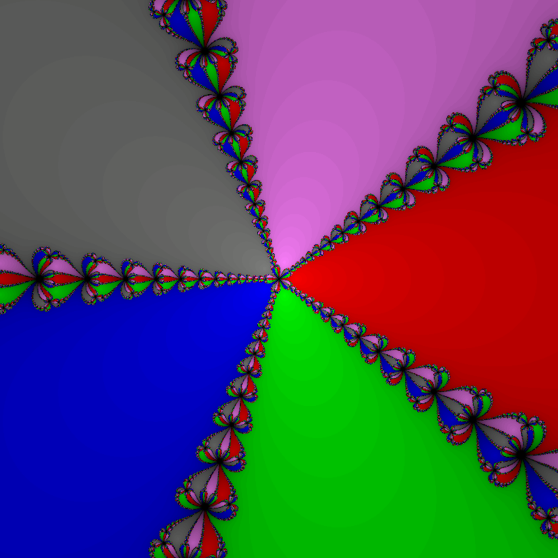

# Newton Fractal (ISPC + C++)

This project visualizes the **Newton Fractal** for the equation:

\[
z^n - 1 = 0
\]

It uses **ISPC** for parallel computation and **C++** for the main program and image generation.

---

## 🧠 Description
The Newton Fractal shows how the convergence of Newton's method depends on the initial complex value \( z_0 \).  
Each pixel corresponds to a starting point \( z_0 = x + iy \), and its color represents which root of the equation the iteration converged to, as well as how fast it converged.

The iterative formula used:
\[
z_{k+1} = z_k - \frac{f(z_k)}{f'(z_k)}, \quad \text{where } f(z) = z^n - 1
\]

---

## ⚙️ Implementation details
- The **parallel part** is implemented in ISPC (`analyzing.ispc`).
- The **serial part** and image saving are written in C++ (`main.cpp`).
- The equation parameter **n** is configurable via console input.

### 🧩 Polar coordinates
To simplify the calculation of \( z^n \) and \( f'(z) \),  
the implementation uses the **polar coordinate system**:

\[
z = r (\cos \theta + i \sin \theta)
\]

This allows efficient computation since:
- The **angle** \( \theta \) is multiplied by \( n \)
- The **modulus** \( r \) is raised to the power of \( n \)

---

## 📷 Example Output
Below is an example image of the fractal for \( n = 5 \):



---

## 🛠️ Build Instructions
1. Make sure **ISPC** and **CMake** are installed.
2. Configure the ISPC path in `CMakeLists.txt`.
3. Build and run using CLion or the command line:
   ```bash
   mkdir build
   cd build
   cmake ..
   cmake --build .
